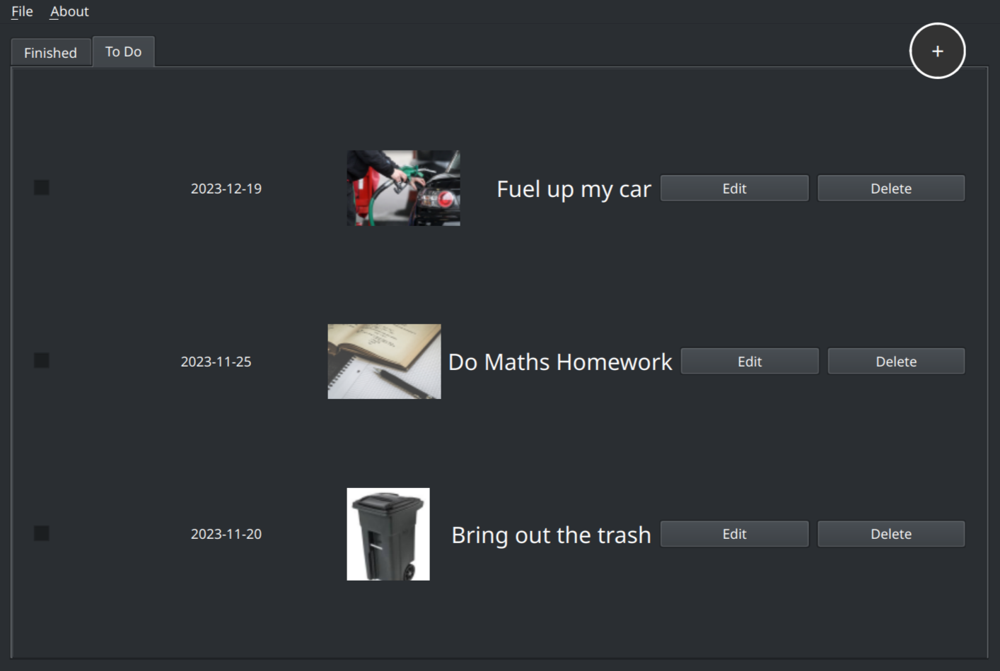

    
    
    

 

    
    <h3 align="center">todoList</h3>
    
Manage your tasks before they manage you.

## Screenshot

    

## Installation on Windows

1. Download the [latest release](https://github.com/Kuuhhl/todoList/releases/latest).
2. Run the `.exe`-file.
3. On the first run, specify an encryption key for the database.

## Developing

1. Clone the repository.
2. Install project dependencies with `pip install -r requirements.txt`
3. Run the application using `python main.py`.

## Testing

1. Make sure all dependencies are installed by running `pip install -r requirements.txt`.
2. Run the unit tests by running `python run_tests.py`.

## Contributors

